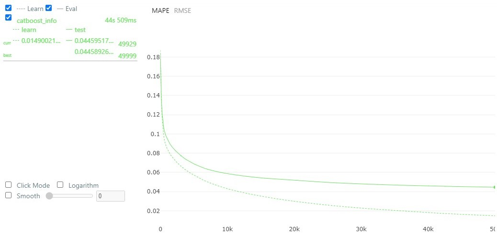
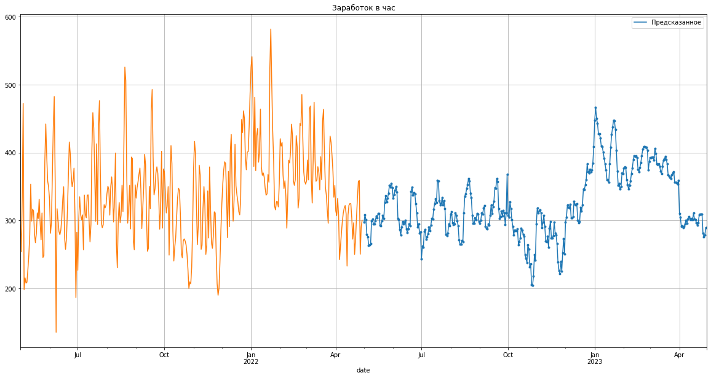

**Прогноз заработка машины таксопарка**
====================================================
---------------------------------------------------------------

## Цель данного Data Science проекта
 * посторить модель машинного обучения на имеющихся реальных данных о заработке машины таксопарка в час
 * Предсказать заработок в час, в день и в месяц на следующие 12 месяцев
 * Рекомендовать, сколько часов работать машине в день, чтоб иметь заданный пользователем заработок в месяц

  

## Результаты работы:

**Метрики работы модели CatBoostRegressor без обогащения данных:**  
> позвляет строить прогноз на **большие промежутки** времени  
> **на основе** лишь заданных **дат**

 * точность прогноза -- **более 95%**
 * MAPE < 4,5%

### Прогноз заработка машины таксопарка в час (от мая 2022): 

На графике показаны: 
* оранжевым цветом -- **реальные** значения за **май '21 -- апрель '22**
* голубым цветом -- **предсказанные** значения на **май '22 -- апрель '23**

> Прогноз получился менее зашумленным, чем реальные данные. 

> Видны периоды стабильного заработка, спада и роста,
> * что позволяет эффективней планировать бюджет и рабочее время.

 

--------------------------------------------------------------- 

 

### **Детали прогноза и рекомендации:**
 

**В каждой таблице:** 
* расчет чистого заработка в час 
* в день при 8-часовом рабочем дне
* рекомендация рабочих часов в день для целевого месячного заработка в 55 тыс.

 

**Прогноз на каждый день:** 

 

**Недельный прогноз с усреднением всех данных:** 

 

**Месячный прогноз с усреднением всех данных:** 

 

---------------------------------------------------------------

 

## Что сделано:

> **Предобработка:**
> * Приведение к фиксированной сетке 
> * Интерполяция
> * Очистка от шума и лишней "сезонности"

> **Анализ:**
> * Проверка на стационарность
> * Коррелограмма

> **Генерация признаков:**  
> * недельный цикл
> * месячный цикл
> * годичный цикл

> **Опробованы модели МО:**
> * CatBoostRegressor 
> * ARIMA (для временных рядов)
> * Keras Sequential (нейросеть)

 

[Ноутбук с кодом на GitHub (в процессе оформления)]()
